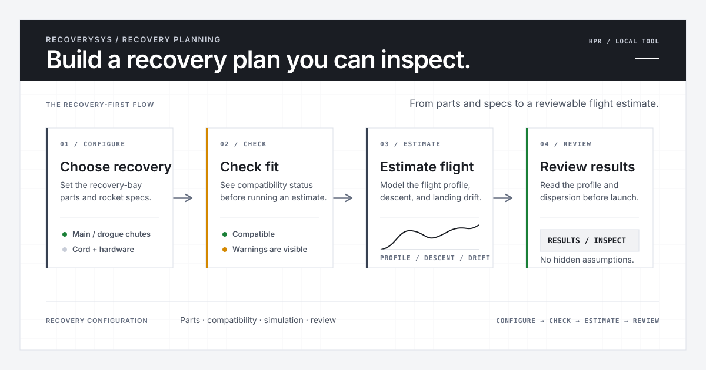

# RecoverySys

RecoverySys is a local-first recovery planning tool for high-power rocketry (HPR). Configure a recovery bay, simulate estimated flight and landing behavior, and review actionable warnings before launch—without an account or application backend.



## Start here

- **[Try the live demo](https://akhan157.github.io/RecoverySys/)**
- **[Current release: v1.2.0.1](https://github.com/akhan157/RecoverySys/releases/tag/v1.2.0.1)**
- **[Desktop build notes](RecoverySys/DESKTOP.md)** — current-main portable artifacts and historical release context

## What it does

- **Configure recovery hardware** from the catalog, including main and drogue chutes, shock cord, protection, quick links, and related parts.
- **Add custom parts** when the catalog does not match the hardware on hand.
- **Simulate estimated flight behavior** from rocket, motor, airframe, deployment, and wind inputs; search ThrustCurve.org or import a RASP `.eng` curve.
- **Explore Monte Carlo dispersion** as a predicted landing estimate with drift vectors and uncertainty circles—not a confidence guarantee.
- **Review compatibility warnings** for packing, bay volume, parachutes, harnesses, and other recovery constraints.
- **Keep a Flight Log** of actual flight records; manage saved configurations, comparisons, JSON export/import, share links, and a printable checklist.
- **Use dark mode** or light mode while working locally.

## Configure → simulate → review

1. Configure the rocket, recovery hardware, deployment settings, and wind; add custom parts if needed.
2. Simulate ascent, apogee, descent, drift, shock load, and landing energy.
3. Review compatibility warnings, the predicted dispersion estimate, and the Flight Log before independently checking the flight plan.

## Scope and safety

RecoverySys is a planning aid, not flight-certification software or a substitute for engineering review, field procedures, manufacturer guidance, or range rules. Results are estimates based on simplifying assumptions and do not guarantee safe, legal, or successful operation. See the [user guide](RecoverySys/README.md) for model, privacy, and network details.

## Documentation

- [User guide, model, privacy, and local-first details](RecoverySys/README.md)
- [Desktop build notes](RecoverySys/DESKTOP.md)
- [Roadmap](RecoverySys/ROADMAP.md)
- [Changelog](RecoverySys/CHANGELOG.md)
- [Contributing](CONTRIBUTING.md)
- [MIT License](LICENSE)

## Local development

From the `RecoverySys` directory (Node.js `^20.19.0 || ^22.13.0 || >=24.0.0`, npm `>=10`):

```bash
npm install
npm run dev
```

Useful checks:

```bash
npm run check
npm run preview
```
